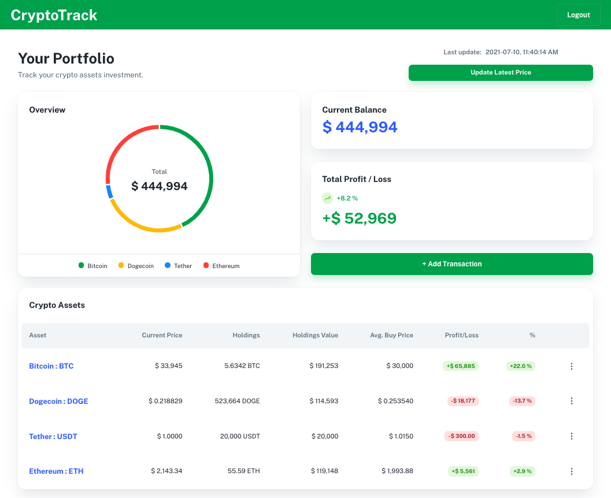

# CryptoTrack

> A web app to track your crypto assets investment. Cryptocurrency prices are updated in real time, powered by [CoinGecko API](https://www.coingecko.com/en/api).

# 

## Built with
- Backend - Node.js & Express
- Frontend - React & [Material-UI](https://material-ui.com) (with [Minimal template](https://material-ui.com/store/previews/minimal-dashboard/))
- Database - PostgreSQL
- API - [CoinGecko](https://www.coingecko.com/en/api)
- Authentication - [JSON Web Token (JWT)](https://jwt.io)

# Setup
Please refer to the [Setup Guide](./setup-guide.txt) for steps to setup in local development.