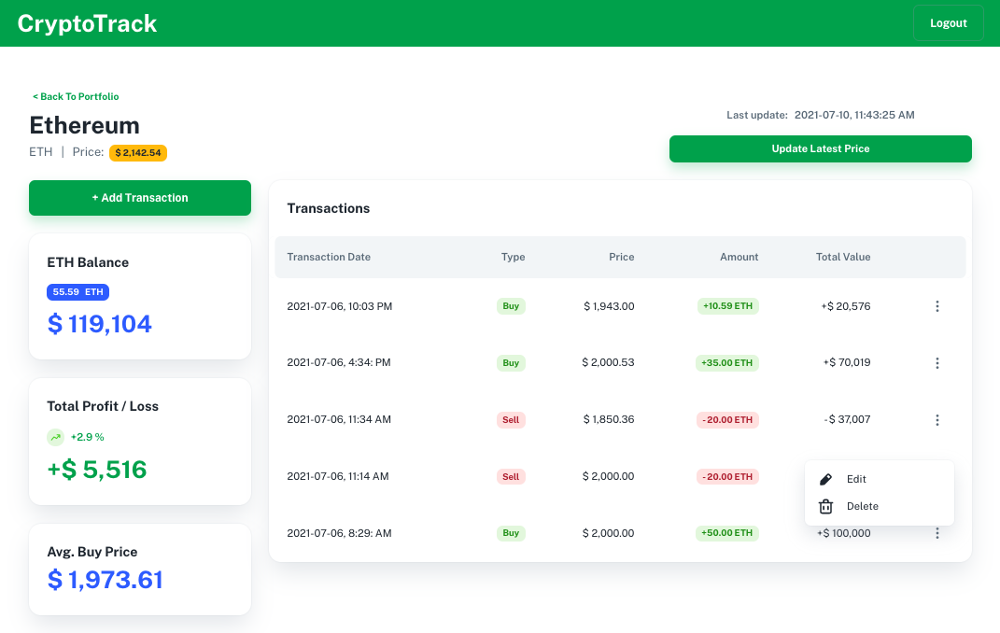
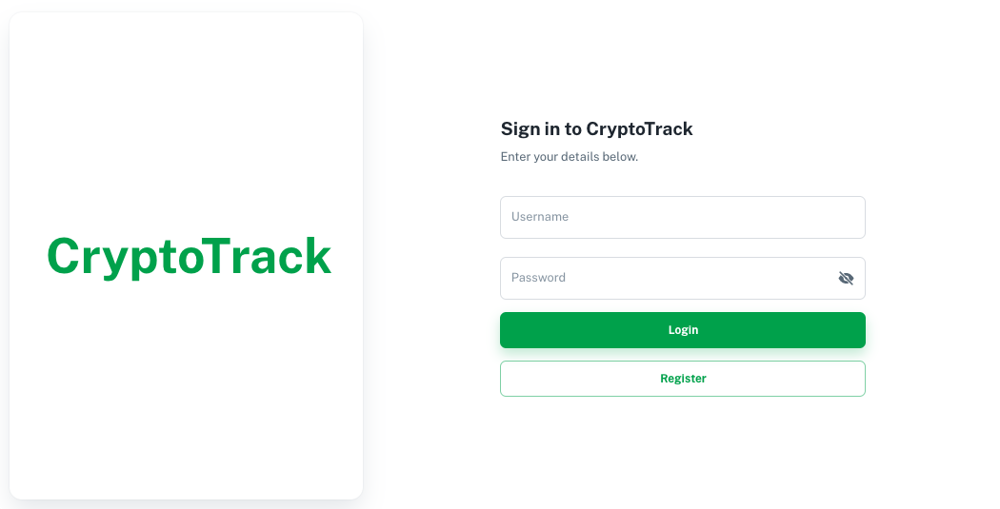

# CryptoTrack

> An easy-to-use web app to track your crypto assets investment. Cryptocurrency prices are updated in real time, powered by [CoinGecko API](https://www.coingecko.com/en/api).

# 

## Motivation

## Tech
- Backend - [Node.js](https://nodejs.org/en/) / [Express](https://expressjs.com)
- Frontend - [React](https://reactjs.org) / [Material-UI](https://material-ui.com) / [Minimal theme](https://material-ui.com/store/previews/minimal-dashboard/)
- Database - [PostgreSQL](https://www.postgresql.org)
- API - [CoinGecko](https://www.coingecko.com/en/api)
- Authentication - [JSON Web Token (JWT)](https://jwt.io)

## Setup
Please refer to the [Setup Guide](./setup-guide.md) for steps to setup in local development.

## Screenshots

## License
MIT