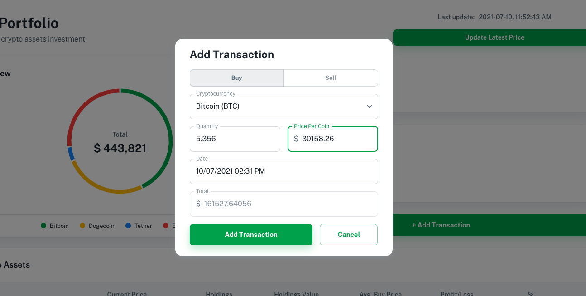

# CryptoTrack
An easy-to-use web app to track your crypto assets investment. Cryptocurrency prices are updated in real time, powered by [CoinGecko API](https://www.coingecko.com/en/api).

# 

## Description
The aim of this project is to demonstrate my ability to create a CRUD application written in Javascript. The app is implemented through the use of RESTful APIs to record the user's cryptocurrency transactions. A third-party API from [CoinGecko](https://www.coingecko.com/en/api) is comsumed to provide real time cryptocurrency prices. [JSON Web Token (JWT)](https://jwt.io) and [bcrypt](https://www.npmjs.com/package/bcrypt) password encryption are used for user authentication, which are considered the industry standards. 

## Tech
- Backend - [Node.js](https://nodejs.org/en/) / [Express](https://expressjs.com)
- Frontend - [React](https://reactjs.org) / [Material-UI](https://material-ui.com) / [Minimal theme](https://material-ui.com/store/previews/minimal-dashboard/)
- Database - [PostgreSQL](https://www.postgresql.org)
- API - [CoinGecko](https://www.coingecko.com/en/api)
- Authentication - [JSON Web Token (JWT)](https://jwt.io)

## Setup
Please refer to the [Setup Guide](./setup-guide.md) for steps to setup in local development.

## Screenshots

## License
MIT